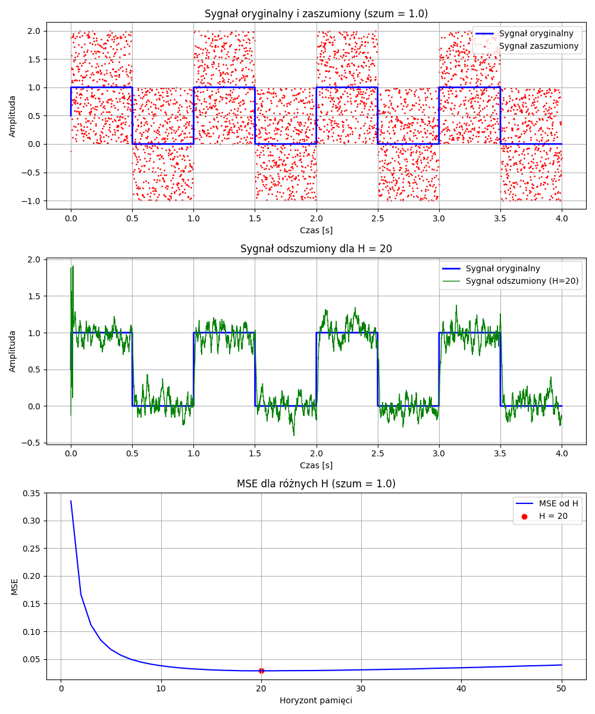

# Adaptive Control - Projects

## Introduction
This project contains three main tasks related to adaptive control. Each project focuses on a different aspect of adaptive control and employs advanced signal analysis and processing algorithms.

---

## Project 1: Analysis of Square Signals

### Objective
1. Generate square signals with uniform distribution noise.
2. Estimate signals using the moving average method.
3. Calculate the Mean Squared Error (MSE).

### Functions Used:
- `generate_square_wave` – generates square signals.
- `add_uniform_noise` – adds noise to the signal.
- `estimate_signal` – estimates the signal using the moving average method.
- `calculate_mse` – calculates the Mean Squared Error.

### Results
The study revealed the dependency of MSE on:
- Memory horizon – there is an optimal value beyond which smoothing becomes ineffective.
- Noise variance – higher variance requires a longer horizon for effective denoising.

Sample result images:

  
  

---

## Project 2: Systems with Dynamic Parameters

### Objective
1. Identify parameters of a stationary system using the Recursive Least Squares (RLS) method.
2. Analyze dynamic systems where parameters change over time.

### Algorithms Used:
- Recursive Least Squares (RLS) method.

### Results
- High efficiency of the RLS method in estimating parameters, both in stationary and dynamic systems.
- Importance of the forgetting factor (λ) – lower values improve responsiveness to changes but increase sensitivity to noise.

Sample result image (dynamic parameters):

  
  

---

## Project 3: Control Optimization

### Objective
1. Simulate the behavior of a two-element system.
2. Identify system parameters.
3. Optimize input signals to minimize costs.

### Algorithms
- Binary search for cost function optimization.
- Signal input reduction algorithm under given constraints.

### Results
- Developed an algorithm for finding optimal control values with logarithmic complexity.
- Visualizations demonstrated the algorithm's effectiveness in minimizing the cost function.

Sample result image (optimal values):

  

---

